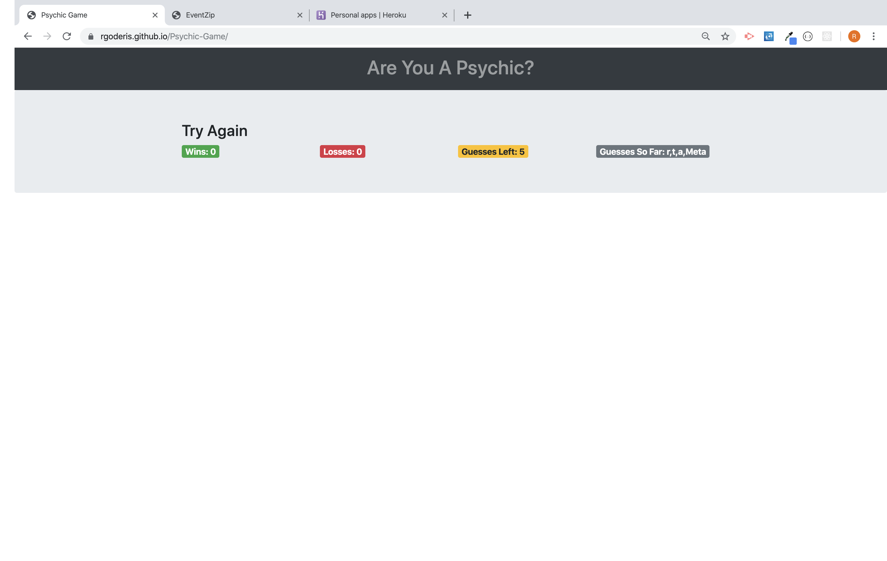

# Psychic Game
Psychic Game is a letter guessing game built with vanilla JavaScript.  The computer guesses a random letter by pulling from an array of letters and the user has 9 opportunities to guess the correct letter.  If the user guesses correctly the score counter increases and the game resets.  If the user runs out of guesses the loss counter increases and the game resets.  

[psychic game](https://rgoderis.github.io/Psychic-Game/)